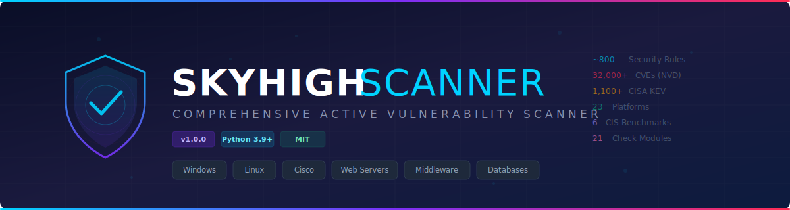

<p align="center">
  
</p>

<p align="center">
  <strong>Comprehensive Active Vulnerability Scanner</strong><br>
  <em>Enterprise-grade security scanning for Windows, Linux, Cisco, Web Servers, Middleware & Databases</em>
</p>

<p align="center">
  <a href="#installation"></a>
  <a href="LICENSE"></a>
  <a href="#supported-platforms"></a>
  <a href="#cve-database"></a>
  <a href="#features"></a>
  <a href="#testing"></a>
</p>

---

## Table of Contents

- [Overview](#overview)
- [Features](#features)
- [Supported Platforms](#supported-platforms)
- [Architecture](#architecture)
- [Installation](#installation)
- [Quick Start](#quick-start)
- [CLI Reference](#cli-reference)
- [CVE Database](#cve-database)
- [Scan Modules](#scan-modules)
- [HTML Reports](#html-reports)
- [Project Structure](#project-structure)
- [Testing](#testing)
- [Contributing](#contributing)
- [License](#license)

---

## Overview

**SkyHigh Scanner** is an open-source active vulnerability scanner inspired by enterprise tools like Tenable Nessus and Rapid7 InsightVM. It connects to live hosts over SSH, WinRM, SNMP, and HTTP to perform authenticated security assessments, CIS benchmark checks, and CVE detection across 23 platforms.

Unlike static analysis tools, SkyHigh Scanner actively queries running systems — reading configurations, checking installed software versions, probing services, and correlating findings against a local CVE database seeded from the NVD and CISA KEV feeds.

### Key Highlights

- **Active scanning** — Connects to live hosts via SSH, WinRM, Netmiko, SNMP, SMB, and HTTP
- **Auto-discovery** — Scans IP ranges, fingerprints services, classifies hosts, and dispatches the right scanner
- **~800 security rules** across 21 check modules
- **32,000+ CVEs** via NVD API 2.0 sync (2010-2025) with CISA KEV + EPSS overlay
- **6 CIS benchmarks** — Windows, Linux, Cisco, Oracle DB, MySQL, MongoDB
- **Interactive HTML reports** — Dark theme, JS filtering, severity-colored cards, print-friendly
- **Graceful degradation** — All transport dependencies are optional; missing libraries are handled cleanly

---

## Features

| Category | Details |
|----------|---------|
| **OS Scanning** | Windows (WinRM/SMB), Linux (SSH), Cisco IOS/IOS-XE/NX-OS (Netmiko/SNMP) |
| **Web Server Scanning** | IIS, Apache HTTPD, Nginx, Tomcat, WebLogic, WebSphere |
| **Middleware Scanning** | Java/JDK, .NET Framework, PHP, Node.js, Laravel, Oracle Middleware |
| **Database Scanning** | Oracle DB, MySQL/MariaDB, MongoDB |
| **CVE Detection** | Version-based CVE matching against local SQLite database with EPSS scores |
| **CIS Benchmarks** | Hardening checks based on CIS benchmark guidelines |
| **Network Discovery** | TCP port scanning, banner grabbing, OS classification |
| **Credential Management** | CLI args, environment variables, or credential files |
| **Reporting** | Console (colored), JSON, CSV, interactive HTML |

---

## Supported Platforms

### Operating Systems
| Platform | Transport | Checks |
|----------|-----------|--------|
| Windows Server / Desktop | WinRM, SMB | Patches, account policies, registry, services, firewall, audit, CIS |
| Linux (Ubuntu, RHEL, CentOS, Debian, SUSE) | SSH (paramiko) | sshd, accounts, permissions, sysctl, packages, CVEs, CIS |
| Cisco IOS / IOS-XE / NX-OS | Netmiko, SNMP | Authentication, SSH, VTY, SNMP, services, interfaces, L2, CVEs, CIS |

### Web Servers
| Server | Detection | Key Checks |
|--------|-----------|------------|
| Microsoft IIS | HTTP headers | Version CVEs, ASP.NET disclosure, WebDAV, default pages |
| Apache HTTPD | Server header | Version CVEs, ServerTokens, directory listing, server-status |
| Nginx | Server header | Version CVEs, stub_status exposure |
| Apache Tomcat | Server header, `/manager` | Version CVEs, Manager app, default credentials, sample apps |
| Oracle WebLogic | `/console` probe | Version CVEs, console exposure, wls-wsat, UDDI SSRF |
| IBM WebSphere | Admin console probe | Admin console, snoop servlet, version leaks |

### Middleware
| Runtime | Detection | Key Checks |
|---------|-----------|------------|
| Java / JDK | `java -version` | EOL versions, Log4j (CVE-2021-44228), Spring Boot Actuator |
| .NET Framework | Registry / `dotnet` | EOL .NET Core, .NET Framework version |
| PHP | `php -v` | EOL versions, php.ini hardening, phpinfo() exposure |
| Node.js | `node -v` | EOL versions, npm audit, Express X-Powered-By |
| Laravel | `php artisan --version` | APP_DEBUG, APP_ENV, APP_KEY, .env exposure, Ignition RCE |
| Oracle Middleware | `sqlplus -V` | Version CVEs, TNS Listener, OEM console |

### Databases
| Database | Detection | Key Checks |
|----------|-----------|------------|
| Oracle DB | Port 1521 | sqlnet.ora encryption, listener security, REMOTE_OS_AUTHENT |
| MySQL / MariaDB | Port 3306 | EOL versions, local_infile, bind-address, TLS |
| MongoDB | Port 27017 | Authorization, bindIp, TLS, audit logging, unauthenticated access |

---

## Architecture

```
                          +------------------+
                          |   CLI (__main__) |
                          +--------+---------+
                                   |
                    +--------------+--------------+
                    |                             |
              +-----+------+            +--------+--------+
              | AutoScanner |            | Direct Scanners |
              +-----+------+            +--------+--------+
                    |                             |
            +-------+-------+        +-----------+-----------+
            | NetworkDiscovery|       | windows | linux | cisco |
            +-------+-------+        | webserver | middleware  |
                    |                 | database               |
            +-------+-------+        +------------------------+
            |   Classify &   |
            |   Dispatch     |
            +----------------+
                    |
     +--------------+--------------+
     |              |              |
+----+----+   +-----+-----+  +----+----+
|Transport|   |CVE Database|  |Reporting|
| SSH     |   | SQLite     |  | HTML    |
| WinRM   |   | NVD Sync   |  | JSON    |
| Netmiko |   | CISA KEV   |  | CSV     |
| SNMP    |   | Seed Data  |  | Console |
| SMB     |   +------------+  +---------+
| HTTP    |
+---------+
```

### Core Components

| Component | File | Purpose |
|-----------|------|---------|
| `Finding` | `core/finding.py` | Standardized finding dataclass shared by all scanners |
| `ScannerBase` | `core/scanner_base.py` | Abstract base class with reporting, filtering, exit codes |
| `Transport` | `core/transport.py` | 6 transport abstractions (SSH, WinRM, Netmiko, SNMP, SMB, HTTP) |
| `CredentialManager` | `core/credential_manager.py` | Unified credential loading (CLI / env / file) |
| `NetworkDiscovery` | `core/discovery.py` | Host probe, port scan, service fingerprint, OS classification |
| `CVEDatabase` | `core/cve_database.py` | SQLite-backed CVE storage with version matching |
| `CVESync` | `core/cve_sync.py` | NVD API 2.0 sync, CISA KEV overlay, vendor feeds |
| `Reporting` | `core/reporting.py` | Interactive HTML report generation |

---

## Installation

### Prerequisites

- **Python 3.9+** (3.10-3.12 recommended)
- **pip** (package manager)

### Install from Source

```bash
git clone https://github.com/Krishcalin/SKYHIGH-SCANNER.git
cd SKYHIGH-SCANNER
pip install -e .
```

### Install with Extras

Install only the transport dependencies you need:

```bash
# Linux scanning (SSH)
pip install -e ".[linux]"

# Cisco scanning (SSH + SNMP)
pip install -e ".[cisco]"

# Windows scanning (WinRM)
pip install -e ".[windows]"

# Everything
pip install -e ".[all]"
```

### Manual Dependency Install

```bash
pip install -r requirements.txt
```

| Dependency | Required For | Optional? |
|------------|-------------|-----------|
| `requests` | HTTP transport, NVD sync, web scanning | Recommended |
| `paramiko` | Linux SSH scanning | Yes |
| `netmiko` | Cisco SSH scanning | Yes |
| `pysnmp-lextudio` | Cisco SNMP scanning | Yes |
| `pywinrm` | Windows WinRM scanning | Yes |
| `impacket` | Windows SMB scanning | Yes |

> All dependencies are optional. The scanner gracefully degrades when a library is missing -- you will see a warning but can still use other scan types.

---

## Quick Start

### 1. Import Seed CVE Data

```bash
python -m skyhigh_scanner cve-import
```

This loads 451 curated CVEs (146 CISA KEV flagged) from the bundled seed files.

### 2. Check CVE Database Stats

```bash
python -m skyhigh_scanner cve-stats
```

### 3. Run a Scan

```bash
# Auto-discover and scan a subnet
python -m skyhigh_scanner auto -r 192.168.1.0/24 -u admin -p secret

# Scan a specific Linux host
python -m skyhigh_scanner linux -t 10.0.1.50 -u root -p password

# Scan a Windows host
python -m skyhigh_scanner windows -t 10.0.1.100 -u administrator -p password

# Scan Cisco devices
python -m skyhigh_scanner cisco -r 10.0.1.0/24 -u admin -p secret --enable-password enable123

# Scan a web server
python -m skyhigh_scanner webserver -t https://example.com

# Scan middleware on a host
python -m skyhigh_scanner middleware -t 10.0.1.50 -u admin -p secret

# Scan databases on a host
python -m skyhigh_scanner database -t 10.0.1.50
```

### 4. Generate Reports

```bash
# JSON output
python -m skyhigh_scanner linux -t 10.0.1.50 -u root -p pass --json report.json

# HTML report
python -m skyhigh_scanner linux -t 10.0.1.50 -u root -p pass --html report.html

# Filter by severity
python -m skyhigh_scanner linux -t 10.0.1.50 -u root -p pass --severity HIGH

# Verbose output
python -m skyhigh_scanner linux -t 10.0.1.50 -u root -p pass -v
```

---

## CLI Reference

```
usage: python -m skyhigh_scanner <command> [options]

Commands:
  auto          Auto-discover hosts and run appropriate scanners
  windows       Scan Windows hosts via WinRM
  linux         Scan Linux hosts via SSH
  cisco         Scan Cisco IOS/IOS-XE devices via SSH/SNMP
  webserver     Scan web servers via HTTP
  middleware    Scan middleware runtimes via SSH/WinRM
  database      Scan database services
  cve-sync      Sync CVEs from NVD API 2.0 (includes EPSS + KEV)
  cve-import    Import seed CVE data from bundled JSON files
  cve-stats     Display CVE database statistics (includes EPSS coverage)
  epss-sync     Fetch/update EPSS scores from FIRST.org API
```

### Common Options

| Flag | Description |
|------|-------------|
| `-t, --target` | Target host (IP or hostname) |
| `-r, --range` | IP range (CIDR, start-end, or comma-separated) |
| `-u, --username` | Authentication username |
| `-p, --password` | Authentication password |
| `--severity` | Minimum severity filter: `CRITICAL`, `HIGH`, `MEDIUM`, `LOW`, `INFO` |
| `--json FILE` | Save findings to JSON file |
| `--html FILE` | Save findings to interactive HTML report |
| `-v, --verbose` | Enable verbose output |
| `--version` | Show scanner version |

### CVE Sync Options

```bash
# Full sync from NVD (2010-2025, ~32,000 CVEs)
python -m skyhigh_scanner cve-sync --api-key YOUR_NVD_API_KEY

# Sync from a specific year
python -m skyhigh_scanner cve-sync --api-key YOUR_NVD_API_KEY --since 2020

# Sync without API key (slower, 6s rate limit)
python -m skyhigh_scanner cve-sync
```

> Get a free NVD API key at https://nvd.nist.gov/developers/request-an-api-key to increase sync speed (0.6s vs 6s between requests).

### EPSS Sync Options

```bash
# Update EPSS scores for all CVEs in the database
python -m skyhigh_scanner epss-sync

# With verbose output
python -m skyhigh_scanner epss-sync -v
```

EPSS (Exploit Prediction Scoring System) scores are fetched from the FIRST.org API and indicate the probability that a CVE will be exploited in the wild within 30 days. Scores are shown in reports as color-coded badges:
- **Red** (>=50%) -- High exploit probability
- **Orange** (>=10%) -- Moderate exploit probability
- **Green** (<10%) -- Low exploit probability

> EPSS is also automatically synced during `cve-sync`. Use `epss-sync` to update scores independently.

### Environment Variables

Instead of passing credentials on the command line, set environment variables:

| Variable | Purpose |
|----------|---------|
| `SKYHIGH_SSH_USERNAME` | SSH username for Linux scanning |
| `SKYHIGH_SSH_PASSWORD` | SSH password |
| `SKYHIGH_WINRM_USERNAME` | WinRM username for Windows scanning |
| `SKYHIGH_WINRM_PASSWORD` | WinRM password |
| `SKYHIGH_SNMP_COMMUNITY` | SNMP community string |
| `SKYHIGH_ENABLE_PASSWORD` | Cisco enable password |
| `NVD_API_KEY` | NVD API key for CVE sync |

---

## CVE Database

SkyHigh Scanner maintains a local SQLite database of CVEs for offline version-based vulnerability matching.

### Database Schema

| Table | Purpose |
|-------|---------|
| `cves` | CVE ID, description, CVSS score, EPSS score, severity, published date, CISA KEV flag |
| `affected_versions` | CPE strings and version ranges per CVE |
| `linux_packages` | Package-level CVE mappings for Linux distributions |
| `sync_metadata` | Tracks last sync timestamps per platform |

### Data Sources

| Source | Coverage | Method |
|--------|----------|--------|
| **Seed files** | 451 curated CVEs (bundled, 21 files) | `cve-import` command |
| **NVD API 2.0** | ~32,000 CVEs (2010-2025) | `cve-sync` command, 49 CPE queries |
| **CISA KEV** | 1,100+ actively exploited CVEs | Overlay during sync |
| **FIRST.org EPSS** | Exploit probability scores (0-100%) | `epss-sync` command or during `cve-sync` |

### CPE Coverage

The scanner syncs CVEs for 49 CPE (Common Platform Enumeration) strings covering:

- Microsoft Windows (Server 2008-2022, Desktop 7-11)
- Linux distributions (Ubuntu, RHEL, CentOS, Debian, SUSE)
- Cisco IOS, IOS-XE, NX-OS
- Apache HTTPD, Nginx, IIS, Tomcat, WebLogic, WebSphere
- Java/JDK, .NET, PHP, Node.js
- Oracle Database, MySQL, MariaDB, MongoDB
- OpenSSL, OpenSSH, Log4j, Spring Framework

---

## Scan Modules

### Rule ID Formats

| Scanner | Format | Example |
|---------|--------|---------|
| Windows | `WIN-{CATEGORY}-{NNN}` | `WIN-ACCT-001` |
| Linux | `LNX-{CATEGORY}-{NNN}` | `LNX-SSH-003` |
| Cisco | `CISCO-{CATEGORY}-{NNN}` | `CISCO-AUTH-001` |
| Web Server | `WEB-{SERVER}-{NNN}` | `WEB-IIS-002` |
| Middleware | `MW-{PLATFORM}-{CAT}-{NNN}` | `MW-JAVA-EOL-001` |
| Database | `DB-{PLATFORM}-{CAT}-{NNN}` | `DB-MYSQL-CFG-001` |
| CVE | `CVE-YYYY-NNNNN` | `CVE-2021-44228` |

### Check Categories

| Category | Description | Rule Count |
|----------|-------------|------------|
| Authentication | Passwords, secrets, AAA, MFA | ~40 |
| Access Control | ACLs, VTY lines, permissions | ~30 |
| Encryption / TLS | SSL/TLS config, ciphers, certificates | ~25 |
| Network Security | Firewall, interfaces, routing, L2 | ~35 |
| Services | Unnecessary services, default configs | ~30 |
| Logging & Audit | Syslog, audit trails, retention | ~20 |
| Patch Management | Missing patches, EOL software | ~50 |
| CVE Detection | Known vulnerability matching | ~800 |
| CIS Benchmarks | Hardening compliance checks | ~100 |
| Configuration | Misconfigurations, defaults | ~70 |

---

## HTML Reports

SkyHigh Scanner generates interactive HTML reports with:

- **Dark theme** with platform-specific accent colors
- **Summary cards** -- total findings, severity breakdown, EPSS high-risk count, scan metadata
- **Severity-colored finding cards** -- CRITICAL (red), HIGH (orange), MEDIUM (yellow), LOW (blue), INFO (gray)
- **EPSS badges** -- Color-coded exploit probability: red (>=50%), orange (>=10%), green (<10%)
- **CISA KEV badges** -- Pulse animation for actively exploited vulnerabilities
- **JavaScript filtering** -- Filter by severity, category, or search text
- **Print-friendly CSS** -- Clean output when printed to PDF
- **Self-contained** -- Single HTML file, no external dependencies

Generate an HTML report by adding `--html report.html` to any scan command.

---

## Project Structure

```
SKYHIGH-SCANNER/
├── banner.svg                    # Project banner
├── LICENSE                       # MIT License
├── README.md                     # This file
├── CLAUDE.md                     # AI assistant project context
├── requirements.txt              # Runtime dependencies
├── requirements-dev.txt          # Dev/test dependencies (pytest, ruff, mypy)
├── setup.py                      # pip install configuration
├── pyproject.toml                # pytest, ruff, mypy configuration
│
├── .github/workflows/
│   └── ci.yml                    # GitHub Actions CI (test, lint, seed validation)
│
├── tests/                        # Test suite (190 tests)
│   ├── conftest.py               # Shared fixtures
│   ├── test_version_utils.py     # Version parsing & range matching (20 tests)
│   ├── test_ip_utils.py          # IP range expansion & DNS (16 tests)
│   ├── test_finding.py           # Finding dataclass & serialisation (10 tests)
│   ├── test_credential_manager.py # Credential loading & env vars (18 tests)
│   ├── test_scanner_base.py      # Base scanner, filtering, export (17 tests)
│   ├── test_cve_database.py      # SQLite import, lookup, KEV flagging (14 tests)
│   ├── test_reporting.py         # HTML generation & XSS escaping (11 tests)
│   ├── test_seed_validation.py   # Seed file integrity & dedup (12 tests)
│   ├── test_epss.py              # EPSS integration end-to-end (27 tests)
│   └── test_cli.py               # CLI argument parsing (25 tests)
│
└── skyhigh_scanner/              # Main package
    ├── __init__.py               # VERSION = "1.0.0"
    ├── __main__.py               # CLI entry point (argparse)
    │
    ├── core/                     # Shared engine
    │   ├── finding.py            # Finding dataclass
    │   ├── scanner_base.py       # ScannerBase ABC
    │   ├── version_utils.py      # Version parsing & comparison
    │   ├── ip_utils.py           # IP range expansion
    │   ├── transport.py          # SSH, WinRM, Netmiko, SNMP, SMB, HTTP
    │   ├── credential_manager.py # Credential loading
    │   ├── discovery.py          # Network discovery & classification
    │   ├── cve_database.py       # SQLite CVE storage
    │   ├── cve_sync.py           # NVD API 2.0 & CISA KEV sync
    │   └── reporting.py          # HTML report generation
    │
    ├── scanners/                 # Scanner modules
    │   ├── auto_scanner.py       # Auto-discover & dispatch
    │   ├── windows_scanner.py    # Windows (WinRM/SMB)
    │   ├── linux_scanner.py      # Linux (SSH)
    │   ├── cisco_scanner.py      # Cisco IOS/IOS-XE (Netmiko/SNMP)
    │   ├── webserver_scanner.py  # Web server fingerprint & dispatch
    │   ├── middleware_scanner.py  # Middleware detection & dispatch
    │   └── database_scanner.py   # Database detection & dispatch
    │
    ├── webservers/               # Web server check modules
    │   ├── iis_checks.py, apache_checks.py, nginx_checks.py
    │   ├── tomcat_checks.py, weblogic_checks.py, websphere_checks.py
    │
    ├── middleware/                # Middleware check modules
    │   ├── java_checks.py, dotnet_checks.py, php_checks.py
    │   ├── nodejs_checks.py, laravel_checks.py, oracle_checks.py
    │
    ├── databases/                # Database check modules
    │   ├── oracle_db_checks.py, mysql_checks.py, mongodb_checks.py
    │
    ├── cve_data/                 # CVE data files
    │   ├── cpe_mappings.json     # 49 CPE strings for NVD sync
    │   └── seed/                 # 21 seed JSON files (451 curated CVEs)
    │
    └── benchmarks/               # CIS benchmark definitions (6 JSON files)
```

---

## Exit Codes

| Code | Meaning |
|------|---------|
| `0` | Scan completed -- no CRITICAL or HIGH findings |
| `1` | Scan completed -- CRITICAL or HIGH findings detected |

---

## Testing

SkyHigh Scanner has a comprehensive test suite covering all core modules.

### Running Tests

```bash
# Install dev dependencies
pip install -r requirements-dev.txt

# Run all tests
pytest

# Run with coverage report
pytest --cov=skyhigh_scanner --cov-report=term-missing

# Run a specific test file
pytest tests/test_version_utils.py

# Run seed validation only
pytest tests/test_seed_validation.py -v
```

### Test Coverage

| Module | Tests | Coverage |
|--------|-------|----------|
| `core/finding.py` | 10 | 100% |
| `core/reporting.py` | 11 | 100% |
| `core/credential_manager.py` | 18 | 98% |
| `core/ip_utils.py` | 16 | 97% |
| `core/version_utils.py` | 20 | 94% |
| `core/scanner_base.py` | 17 | 93% |
| `core/cve_database.py` | 14 | 85% |
| EPSS integration | 27 | N/A (cross-module) |
| Seed file validation | 12 | N/A |
| CLI argument parsing | 25 | N/A |
| **Total** | **190** | |

### CI Pipeline

GitHub Actions runs automatically on push/PR to `main`:

- **Test** -- Matrix across Python 3.9, 3.10, 3.11, 3.12 with coverage
- **Lint** -- `ruff check` for code quality
- **Seed Validation** -- Schema, format, and duplicate checks on all CVE seed files

### Seed File Validation

The test suite validates all 21 seed JSON files for:
- Valid JSON structure (array or `{"cves": [...]}` wrapper)
- Required fields: `cve_id`, `platform`, `severity`, `published`, `name`
- Valid severity values (`CRITICAL`, `HIGH`, `MEDIUM`, `LOW`, `INFO`)
- CVE ID format (`CVE-YYYY-NNNNN`)
- CVSS scores in 0.0-10.0 range
- EPSS scores in 0.0-1.0 range
- No duplicate CVE IDs within files
- No same-platform duplicates across files

---

## Contributing

Contributions are welcome! Here's how to get started:

1. **Fork** the repository
2. **Create** a feature branch: `git checkout -b feature/my-feature`
3. **Install** dev dependencies: `pip install -r requirements-dev.txt`
4. **Make** your changes
5. **Run tests**: `pytest` -- all 190 tests must pass
6. **Lint**: `ruff check skyhigh_scanner/ tests/`
7. **Commit**: `git commit -m "Add my feature"`
8. **Push**: `git push origin feature/my-feature`
9. **Open** a Pull Request

### Adding a New Scanner Module

1. Create a new scanner class extending `ScannerBase`
2. Define rule dictionaries with `id`, `category`, `name`, `severity`, `description`, `recommendation`
3. Implement `scan()` method using the appropriate transport from `core/transport.py`
4. Register the scanner in `__main__.py` as a new sub-command
5. Add seed CVE data in `cve_data/seed/`
6. Add CPE strings in `cve_data/cpe_mappings.json`

### Adding New CVE Seed Data

1. Create or update a JSON file in `cve_data/seed/`
2. Follow the existing format: `{ "cves": [ { "cve_id": "...", "description": "...", ... } ] }`
3. Run `python -m skyhigh_scanner cve-import` to load the data

---

## Disclaimer

This tool is intended for **authorized security testing only**. Always obtain proper authorization before scanning any systems. Unauthorized scanning may violate laws and regulations. The authors are not responsible for misuse of this tool.

---

## License

This project is licensed under the **MIT License** -- see the [LICENSE](LICENSE) file for details.

Copyright (c) 2026 KRISH

---

<p align="center">
  <sub>Built with care for the security community</sub>
</p>
